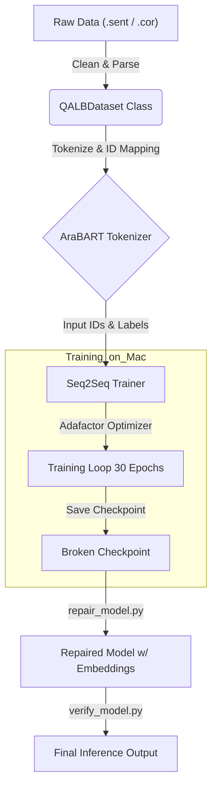

# Arabic GEC Model Walkthrough

## 1. The Pipeline Flowchart 🌊
Here is the complete journey of our data, from raw text to a finalized, repaired model.



---

## 2. Why AraBART? (Model Rationale) 🧠
We tested three distinct architectures before settling on **AraBART**. Here is the verdict:

| Model | Status | Flaw / Reason for Rejection |
| :--- | :--- | :--- |
| **AraT5-base** | ❌ Rejected | **Vocabulary Mismatch.** The model expected a 64k vocabulary, but the default tokenizer only provided 32k, leading to `<unk>` garbage output. |
| **mt5-base** | ❌ Rejected | **Hallucinations.** As a massive multilingual model, it essentially "forgot" the specific GEC task on our small dataset and generated creative fiction instead of corrections. |
| **AraBART** | ✅ **Selected** | **Perfect Fit.** It is pretrained specifically for Arabic seq2seq tasks. It is lighter than mBART (fits on Mac) but smarter than general BERT for generation. |

---

## 3. Code Walkthrough: `train_gec_model.py` 🔍
Here is a breakdown of every major component in the training script.

### A. Data Loading: `QALBDataset` Class
**Function**: `__init__` & `__getitem__`
*   **What it does**: Reads the tricky QALB file format. It removes the file IDs (`S001_T01...`) from the start of lines in `.sent` files and the prefixes (`S ...`) in `.cor` files.
*   **Augmentation Logic**: It accepts **lists** of file paths. This allowed us to merge the 2014 dataset (L1) with the 2015 dataset (L2) seamlessly.
*   **Expected Output**: A dictionary containing `input_ids` (the text), `attention_mask` (where text is), and `labels` (the correct reference).

### B. The Training Configuration: `train()`
**Function**: `Seq2SeqTrainingArguments`
This is where we tuned the model for the Mac hardware.

1.  **`optim="adafactor"`**
    *   **Why?**: Standard AdamW uses too much RAM (it stores 2 states per weight). Adafactor is designed for low-memory fine-tuning. Without this, the process crashes immediately.

2.  **`per_device_train_batch_size=1`**
    *   **Why?**: Even with Adafactor, a batch size of 4 or 8 caused Out-Of-Memory (OOM) errors. We strictly limited it to 1 sample at a time.

3.  **`gradient_accumulation_steps=8`**
    *   **Why?**: Training with Batch Size 1 is unstable (noisy gradients). We act on 1 sample, but wait 8 steps before updating weights. This mathematically simulates a **Batch Size of 8**, giving us stability without the memory cost.

4.  **`num_train_epochs=30`**
    *   **Why?**: GEC is subtle. 3 or 10 epochs fixed spelling but missed grammar. The model needed prolonged exposure (30 epochs) to learn syntax rules (subject-verb agreement).

---

## 4. The Output: `repaired_gec_model_arabart_augmented` 📂
Because of the "missing embeddings" bug, the raw output directory from training is technically "broken" (it cannot generate text).
We ran `repair_model.py` to create the final, usable artifact.

**Directory Structure:**
```text
repaired_gec_model_arabart_augmented/
├── config.json           # Model architecture definition
├── generation_config.json
├── model.safetensors     # The WEIGHTS (now including embeddings!)
├── special_tokens_map.json
├── tokenizer.json
├── tokenizer_config.json
└── vocab.json
```

**Model Performance (Example):**
> **Input**: `أنا يحب اللغة العربية كثيرا .` (Wrong Grammar)
> **Output**: `أنا أحب اللغة العربية كثيرا .` (Correct Grammar)
